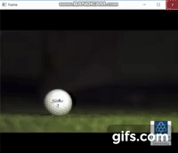

# Golf Trail

This project focuses on predicting the final golf ball location after the ball is hit by the golfer with only one camera using Machine Learning Algorithms and Open CV.

## Getting Strated 

These instructions will get you a copy of the project up and running on your local machine for development and testing purposes. See deployment for notes on how to deploy the project on a live system.The full project is deployed for Yamaha Motors and this is only a prototyped version. If anyone wants to get insights of the project they can mail me at utkarsh1148@gmail.com.

1) To install the dependencies, you need to ``install`` the following:

- python 3
- openCV-python
- numpy
- mathplotlib
- scipy
- csv

2) Capture the side view of the shot.

3) Run ``final_show.py`` to get real time prediction.

 

5) Mark the position of ball to create a contour over it.

6) Press 'enter' to Continue.

7) Optical Flow would mark 3 points on the ball and track the pixel coordinates. 

 
 
8) Graph is plotted.

 

8) Close that figure and you would get the final graph of the ball.
 
 

9) This would give your final predictible position of the shot.

## Factors Considered

- Initial Speed
- Angle of projection
- Angle from Ground
- Spin of the ball
- Wind speed
- Air drag
- Magnus Effect
- Coefficient of friction of ground
- Ball Weight

## Versioning

We use [SemVer](http://semver.org/) for versioning.

## Contributing

Please feel free to contribute. We would love to see pull requests from you guys.

## Authors
* **Prayag Lehna**
* **Utkarsh Mishra**
* **Abhishek Sikari**
* **Pranav Magga**
